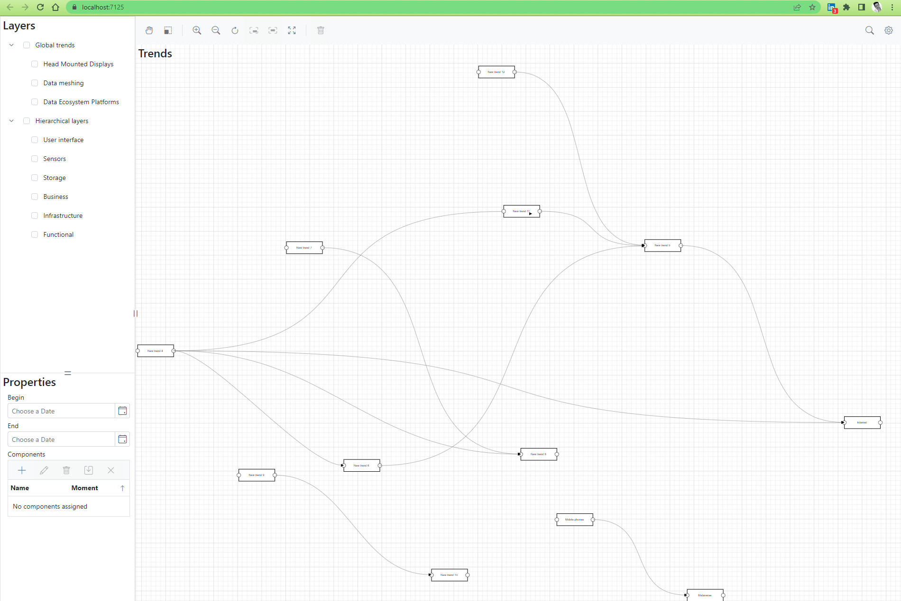

# EtAlii.Trends

The EtAlii.Trends project is meant as a tool to be used for Constructive Technology assessment.

Teaser screenshot can be found below:

Remark: This project heavily relies on Syncfusion components. As this project is meant as a community, open source project there is will be a community license requested for when a public service is made online. However first task is ironing out all of the functional and technical quirks.
